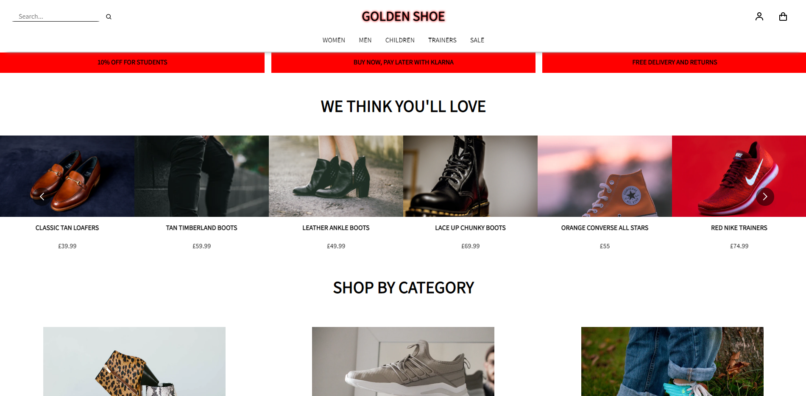

<h1> GOLDEN SHOE - Case Study </h1>

<h2> Table of Contents </h2>

- [About the Project](#about-the-project)
- [Getting Started](#getting-started)
  - [Installation](#installation)
  - [Launch the app](#launch-the-app)
- [Questions](#questions)
- [Screenshots](#screenshots)

## About the Project

This project is a case study for AND Digital.

I was tasked with redesigning a fiction footwear retailer's website, to solve a variety of challenges and provide solutions for problem areas.

The app was built with a React front end, MongoDB database, and an Apollo server with GraphQL queries and mutations to fetch and modify data.

## Getting Started

### Installation

```
git clone https://github.com/natasha-mann/golden-shoe.git
cd golden-shoe
npm run install
```

`npm run install` is a custom script which will install all required packages on the server, seed the data and then install all required packages on the client.

### Launch the app

To run the client and server concurrently, please use the following command:

```

npm run develop

```

## Questions

If you have any questions about this application, please contact me by [email](mailto:natasha.s.mann@gmail.com).

## Screenshots


